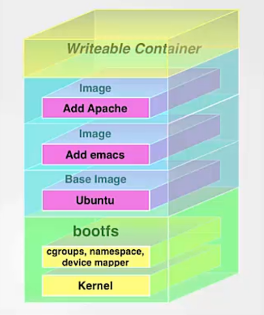
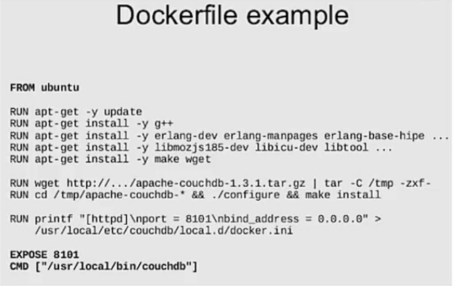
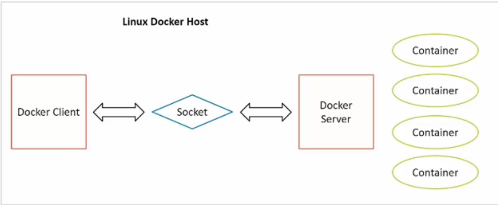
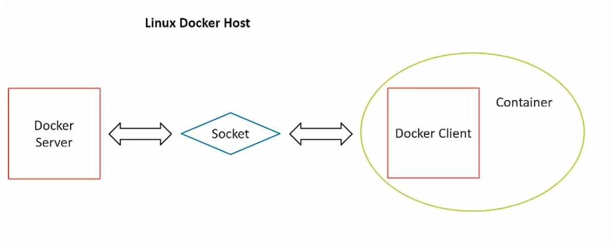
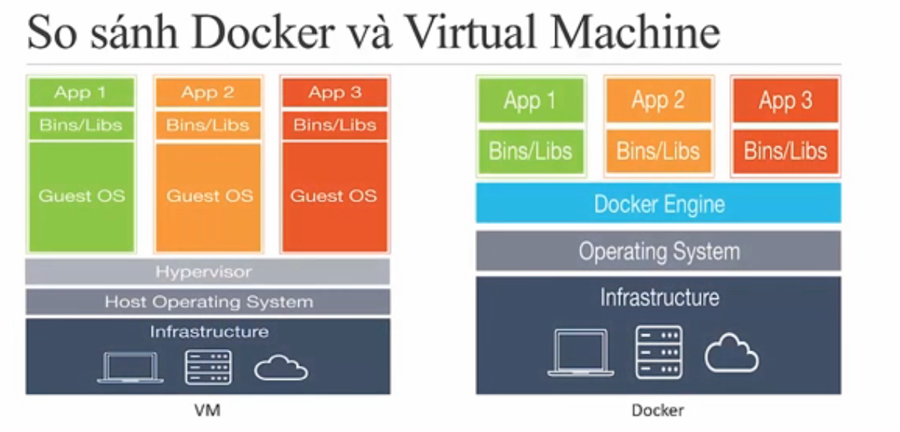
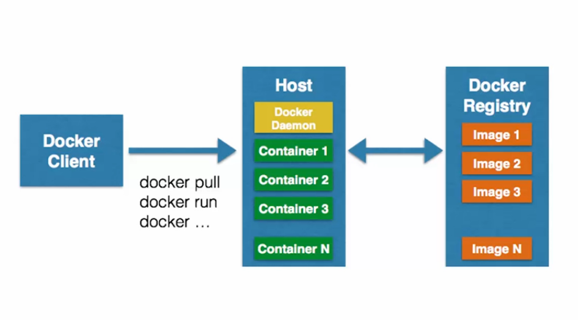
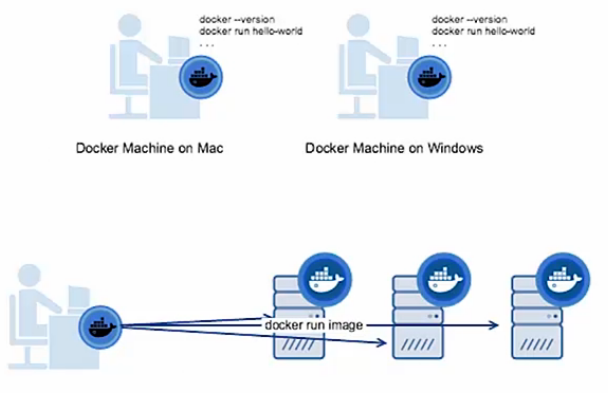
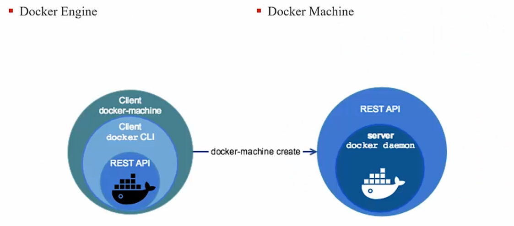

# Docker

### 1. Giới thiệu

#### 1.1. Giới thiệu

Kiến thức có được:
- Hiểu được các thành phần cấu thành nền tảng Docker
- Hiểu được các khái niệm cốt lõi: container và image
- Chạy và quản lý Docker container sử dụng image có sẵn
- Tạo image từ container
- Tự tạo image từ Dockerfile
- Upload và download image
- Thiết lập cấu hình mạng và chạy các container cùng mạng
- Cấu hình mà mount volume trên các container

Yêu cầu:
- Kiến thức cơ bản về lập trình
- CLI căn bản
- Công nghệ ảo hóa
- Kiến thức mạng
- Bash & shell script

#### 1.2. Docker là gì

##### Docker là gì:

Dự án mã nguồn mở trên Github: https://github.com/docker
Tên công ty xây dựng nên nó (tên cũ: dotCloud)

- dotCloud chuyên cung cấp các dịch vụ điện toán đám mây
- Hiện tại chỉ tập trung và lĩnh vực container
- Trang chủ: https://www.docker.com/

##### Docker dùng để làm gì:

Tạo ra các container cho các ứng dụng phần mềm: ở mức độ Linux, VM, Applicaton,...

Vận chuyển container đến các môi trường dev hoặc hỗ trợ việc chia sẻ cho cac dev khác

##### Khẩu quyết của Docker:

Build, ship and deploy any application, anywhere
- Build: đóng gói app trong 1 container
- Ship: vận chuyển container
- Deploy: triển khai, chạy container
- Any app chạy được trên Linux
- Anywhere: server, cloud instaince,..

```code
Đóng gói phần mềm dễ dàng
Deploy nhanh
Không cần cấu hình và môi trường cài đặt rườm rà
```

- Image: compoment để triển khai ứng dụng bao gồm: mã nguồn, thư viện, framework, file,..
  - Trừu tượng hóa giải pháp và đóng gói vào một image kèm dependencies
  ==> Tránh conflict môi trường triển khai

Batteries included but replaceable
- Một compoment có thể được dễ dàng thay thế bằng cách implement cùng 1 interface có sẵn
- Docker framework được phân chia thành các module có khả năng mở rộng cao.
  - Các compoment có thể thay thế bằng các compoment tương tự từ hãng thứ 3, thậm chí chức năng còn ưu việt hơn

##### Một số thuật ngữ:

_Image:_
  - Khuôn mẫu, lớp chia chứa các file cần thiết để tạo nện một container
  - Chứa nh tài nguyên có sẵn
  - Không được tiếp cận CPU, memory, storage,..

_Container:_
  - Tồn tại trên host với một IP
  - Được deploy, chạy và xóa bỏ thông qua remote client


_Docker engine:_
  - Tạo và chạy container
  - Chạy lệnh trong chế độ daemon
  - Linux trở thành máy chủ Docker
  - Container được deploy, chạy, xóa bỏ qua remote client
  - "Docker engine nằm trên layer OS và nằm dưới layer lib/app, mỗi cột lib/app tượng trưng cho một container mà docker engine quản lý"

_Docker daemon_
  - Tiến trình chạy ngầm quản lý các container

_Docker client_
  - Kiểm soát hầu hết các workflow của Docker
  - Giao tiếp với các máy chủ Docker thông qua Deamon

_Docker Hub_
  - Chứa các compoment Docker
  - Cho phép lưu, sử dụng, tìm kiếm image
  - Vai trò: "ship" trong "Build, ship, deploy"
  - "Docker Hub giúp vận chuyển các image từ dev này đến dev khác thông qua hệ thống revison, tới server để test iteration, tới các deployment platform"

##### Điểm mạnh của Docker:

Deploy nhanh hơn
- Hệ thống augmented file system
- Thêm các layer bên trên root kernel

  

  Root kernel là system read only.Bạn muốn viết thêm gì lên trên nó thì bản chất là bạn viết thêm một lớp layer khác ở phía trên. Ví dụ: deploy mongodb bạn ghi thêm 1 lớp layer, muốn deploy nodejs thì ghi thêm 1 lớp layer nữa phía trên, Cuối cùng thì các tất cả các layer đó được tổng hợp tạo thành một > tạo ra container mới rất nhanh chóng và gọn nhẹ

- Độc lập
  - Lỗi xảy ra với một container không ảnh hưởng đến container khác
- Cơ động
  - Tránh conflict môi trường
  - Trao đổi giữa các máy
  - Nhất quán khi chạy trên các môi trường khác nhau
- Chụp ảnh hệ thống (snapshot)
  - Lưu snapshot thành các container hoặc Image
  - Tag
  - Tạo container y hệt từ snapshot
- Kiểm soát việc sử dụng tài nguyên (CP, RAM, storage, ..)
- Đơn giản hóa sự phụ thuộc lẫn nhau giữa các ứng dụng (dependency)
  - Xác định dependency ở Dockerfile

  

- Thuận tiện cho việc chia sẻ
  - Docker Hub (private/public registry)
  - Dockerfile

##### Một số lầm tưởng về Docker

- KHÔNG PHẢI công cụ quản lý thiết lập hay thiết lập tự động (Puppet, Chef,..)
- KHÔNG PHẢI giải pháp ảo hóa phần cứng (VMware, KVM,..)
- KHÔNG PHẢI giải pháp ảo hóa phần cứng (VMware, KVM,..)
- KHÔNG PHẢI là một nền tảng điện toán đám mây (Openstack, CloudStack,..)
- KHÔNG PHẢI là deployment framework (Capistano, Fabric..)
- KHÔNG PHẢI là một công cụ quản lý workflow (Mesos, Fleet,..)
- KHÔNG PHẢI là một môi trường phát triển (Vagrant,..)

#### 1.3 Cơ chế hoạt động của Docker

##### Kernel

- Phản hồi các thông điệp từ phần cứng
- Khởi tạo và đặt lịch cho các chương trình
- Quẩn lý và hệ thống các tác vụ
- Truyền tin giữa các chương trình
- Phân chia tài nguyên, bộ nhớ, CPU, mạng,...
- Tạo container bằng cách chỉnh thiết lập container

##### Docker

- Viết trên ngôn ngữ Go (1 ngôn ngữ hệ thống)
- Quản lý các đặc tính của kernel
  - 'cgroup': nhóm các tiến trình với nhau và bao lại các tiến trình cùng nhóm trong 1 khoảng không gian ảo riêng, vì thế các container không can thiệp lẫn nhau được
  - 'namespace': chia tách các tầng network nên tập địa chỉ cho các container khác, và các địa chỉ cho những thứ không thuộc container nào.
  - 'copy-on-write': định nghĩa image để nói rằng có image này không thay đổi nhưng bạn có thể chạy những thứ khác trên nó.
- Hướng tiếp cận đã tồn tại vài năm trước khi có docker
- Docker đơn giản hóa việc viết script cho các hệ thống phân tán

##### Socket điều khiển của Docker

- Docker bao gồm 2 phần: client và server
- Server nhận lệnh qua socket (mạng hoặc file)
- Chạy Docker ở máy local:



- Chạy Docker ở bên trong client



#### 1.4 Docker khác gì so với virtual machine?




|VM | Docker |
|--------------|-------|
| Công nghệ ảo hóa |Công nghệ container hóa |
| Chạy hệ điều hành riêng trong môi trường phần cứng giả lập được cung cấp bởi hypervisor chạy trên phần cứng vật lý | Container hóa cho phép nhiều ứng dụng chạy trên các partition độc lập trên Linux kernel, và chạy trực tiếp trên phần cứng vật lý |
| Kernel riêng | Kernel chung với hệ điều hành |
| Khởi động cả hệ điều hành | Khởi động một số process |
| Tốc độc chậm | Tốc độ nhanh |
| Cần nhiều tài nguyên | Tiết kiệm tài nguyên |

Lựa chọn Docker và VM
- VM: phân tách tài nguyên phần cứng rõ ràng
- Docker: phân tách tài nguyên tương đối, ứng dụng đóng gói dễ dàng kèm dependency


#### 1.5 Kiến trúc Docker



Kiến trúc client-server
3 thành phần chính:
- Docker Client
- Docker Host
- Docker Registry (Hub)

Docker Daemon nhận lệnh từ Docker client thông qua CLI hoặc REST-API

Docker Client ở trên cùng host hoặc khác host với Docker Daemon

Docker Hub: dịch vụ lưu trữ, chia sẻ image

Nhiều container có thể liên kết với nhau để tạo kiến trúc ứng dụng đa tầng. Nếu đóng nhiều container và chưa commit thì mọi thay đổi trên container sẽ bị mất.

#### 1.6 Docker Toolbox

Là bộ cài đặt Docker cho môi trường Windows và Mac dành cho những thiết bị không đạt yêu cầu để cài đặt bộ cài đặt mới.

Bao gồm các công cụ:

- Docker Machine: quản lý host bằng các lệnh docker-machine
- Docker engine: chạy các lệnh docker
- Docker Compose: thiết lập việc chạy nhiều container trong Docker
- Kitematic: giao diện hiển thị cho Docker
- Shell thiết lập sẵn để phục vụ cho môi trường CLI trên docker
- Oracle virtualbox ảo

#### 1.7 Docker Machine

Công cụ giúp cài đặt Docker Engine trên các host ảo
Quản lý các host đó bằng lệnh docker-manchine
Từng là cách duy nhất để chạy Docker trên Windows và Mac trước Docker v1.12

##### Docker machine dùng để làm gì?



Máy thuộc OS Windows/Mac đời cũ
Tạo docker host trên các hệ thống remote
- Cài docker machine trên win,linux,mac
- Mỗi host machine = 1 docker host + 1 docker client

##### Docker Engine vs Docker Machine



_Docker Engine_
- Mô hình client-server
- Tạo bởi Docker daemon, REST API, docker client CLI

_Docker Machine_
- Quản lý docker host


#### 1.8 Docker Hub

Dịch vụ registry trên cloud
Kết nối tới code repository, build, test và deploy image
Cung cấp tài nguyên một cách tập trung cho việc tìm kiếm image, phân phối và quản lý các thay đổi của image
DevOps và developer có thể dùng các image một cách tự động và theo flow

##### Tính năng của Docker Hub

Image repository: tìm kiếm, lưu trữ, push và pull image cho cộng đồng người dùng docker
Build tự động: build những image khi có sự thay đổi code cho sản phẩm
Webhook: là 1 tính năng của tự động build, webhook thông báo cho các bạn biết khi có push thành công lên repository.
Tổ chức: tạo nhóm làm việc để quản lý truy cập vào image repository.
Tích hợp Github và Bitbucket

Đăng ký tại: https://hub.docker.com/

### 2. Cài đặt Docker

#### 2.1 Cài đặt Docker trên Windows

#### 2.1 Cài đặt Docker trên Linux

```sh
# First import the GPG key to trust app from docker
sudo apt-key adv --keyserver hkp://p80.pool.sks-keyservers.net:80 \
      --recv-keys 58118E89F3A912897C070ADBF76221572C52609D
# Next, point the package manager to the official Docker repository
sudo apt-add-repository 'deb https://apt.dockerproject.org/repo ubuntu-xenial main'
# Update the package database
 sudo apt update
# Install Docker
sudo apt install docker-engine
# Start docker server
sudo service docker start
sudo docker run hello-world
#
sudo groupadd docker
sudo usermod -aG docker nvn(username)
logout
# Run a Docker container using the official Ubuntu image
docker run -it ubuntu bash

```

### 3. Vòng đời Docker
#### 3.1 Giới thiệu image
Docker Image là file chứa đựng những thứ đủ để tạo được một hệ điều hành
để phục vụ cho 1 công việc nhất định.
Thường thì bạn cài 1 OS để đủ các ứng dụng bạn cần để làm việc
Sử dụng docker bạn có thể cấu hình, tạo ra các container chỉ với những tài nguyên thực sự cần thiết. Và bạn thậm chí có thể tạo rất nhiều những container như vậy trên máy của mình không bị nặng máy như bạn chạy nhiều máy ảo cùng 1 lúc
`docker images`
```sh
nvn@water ~ $ docker images
REPOSITORY          TAG                 IMAGE ID            CREATED             SIZE
ubuntu              latest              f975c5035748        4 weeks ago         112MB
centos              latest              2d194b392dd1        4 weeks ago         195MB
REPOSITORY: nơi tạo ra image
TAG: version
```

#### 3.2 Giới thiệu container

Chạy container từ image có sẵn:
`docker run -it ubuntu bash` '-ti: nhận input từ bàn phím'
```sh
nvn@water ~ $ docker run -ti ubuntu:latest bash
root@560ec4856f91:/# ls
bin  boot  dev  etc  home  lib  lib64  media  mnt  opt  proc  root  run  sbin  srv  sys  tmp  usr  var
root@560ec4856f91:/# pwd
/
root@560ec4856f91:/# cat /etc/lsb-release
DISTRIB_ID=Ubuntu
DISTRIB_RELEASE=16.04
DISTRIB_CODENAME=xenial
DISTRIB_DESCRIPTION="Ubuntu 16.04.4 LTS"
root@560ec4856f91:/#

nvn@water ~ $ docker ps
CONTAINER ID        IMAGE               COMMAND             CREATED              STATUS              PORTS               NAMES
2a92201ef89f        ubuntu              "bash"              7 seconds ago        Up 7 seconds                            determined_wescoff
560ec4856f91        ubuntu:latest       "bash"              About a minute ago   Up About a minute                       elated_heisenberg

```

#### 3.3 Vòng đời Docker
Quy trình Docker
-Mỗi bản build tạo ra một image nhất định
-Container là một instance của image
- __Dockerfile__ _build_ __Image__ _run_ __Containers__

Khi ở trong một container khởi tạo từ 1 image thì image đó là cố định - không bao giờ bị thay đổi

```sh
root@560ec4856f91:/# touch NEW_FILE
root@560ec4856f91:/# ls
NEW_FILE  bin  boot  dev  etc  home  lib  lib64  media  mnt  opt  proc  root  run  sbin  srv  sys  tmp  usr  var

root@2a92201ef89f:/# ls
bin  boot  dev  etc  home  lib  lib64  media  mnt  opt  proc  root  run  sbin  srv  sys  tmp  usr  var
```

__Image__  _run_  __Containers__  _stop_  __Stop_container__  _commit_  __Image__

```sh
nvn@water ~ $ docker ps -l
CONTAINER ID        IMAGE               COMMAND             CREATED             STATUS              PORTS               NAMES
2a92201ef89f        ubuntu              "bash"              10 minutes ago      Up 10 minutes                           determined_wescoff
nvn@water ~ $ docker ps -a
CONTAINER ID        IMAGE               COMMAND                  CREATED             STATUS                        PORTS               NAMES
2a92201ef89f        ubuntu              "bash"                   10 minutes ago      Up 10 minutes                                     determined_wescoff
560ec4856f91        ubuntu:latest       "bash"                   11 minutes ago      Up 11 minutes                                     elated_heisenberg
9b26edec3d91        ubuntu:latest       "bash"                   12 minutes ago      Exited (130) 11 minutes ago                       infallible_pike
942249b4d20f        ubuntu              "bash -c 'sleep 3;..."   3 days ago          Exited (0) 3 days ago                             upbeat_jones
27c5993988d8        centos              "/bin/bash"              3 days ago          Exited (0) 3 days ago                             friendly_poitras
```
status - giá trị trả về của bất kỳ process mà bạn chạy
- status 0: thành công
- status 130: thoát bởi Ctrl + D, Ctrl + C
- status 127:
- status 126: câu lệnh không chạy
- status 125: bản thân docker bị lỗi

```sh
NEW_FILE  README.txt  bin  boot  dev  etc  home  lib  lib64  media  mnt  opt  proc  root  run  sbin  srv  sys  tmp  usr  var
root@560ec4856f91:/# exit
exit
nvn@water ~ $ docker ps -l
CONTAINER ID        IMAGE               COMMAND             CREATED             STATUS              PORTS               NAMES
2a92201ef89f        ubuntu              "bash"              18 minutes ago      Up 18 minutes                           determined_wescoff
nvn@water ~ $ docker commit 2a92201ef89f
sha256:e6f9497fe14c09df2c7d5e37b1ce4b8b040a2270d4694fd7bb47d2b44f202c8a
nvn@water ~ $ docker images
REPOSITORY          TAG                 IMAGE ID            CREATED             SIZE
<none>              <none>              e6f9497fe14c        8 seconds ago       112MB
ubuntu              latest              f975c5035748        4 weeks ago         112MB
centos              latest              2d194b392dd1        4 weeks ago         195MB

nvn@water ~ $ docker run -ti ubuntu:latest bash
root@560ec4856f91:/# ls
bin  boot  dev  etc  home  lib  lib64  media  mnt  opt  proc  root  run  sbin  srv  sys  tmp  usr  var
root@560ec4856f91:/# touch README.txt

root@560ec4856f91:/# ls
NEW_FILE  README.txt  bin  boot  dev  etc  home  lib  lib64  media  mnt  opt  proc  root  run  sbin  srv  sys  tmp  usr  var
root@560ec4856f91:/# exit
exit

nvn@water ~ $ docker ps -l
CONTAINER ID        IMAGE               COMMAND             CREATED             STATUS              PORTS               NAMES
2a92201ef89f        ubuntu              "bash"              18 minutes ago      Up 18 minutes                           determined_wescoff
nvn@water ~ $ docker commit 2a92201ef89f
sha256:e6f9497fe14c09df2c7d5e37b1ce4b8b040a2270d4694fd7bb47d2b44f202c8a

nvn@water ~ $ docker images
REPOSITORY          TAG                 IMAGE ID            CREATED             SIZE
<none>              <none>              e6f9497fe14c        8 seconds ago       112MB
ubuntu              latest              f975c5035748        4 weeks ago         112MB
centos              latest              2d194b392dd1        4 weeks ago         195MB

nvn@water ~ $ docker tag e6f9497fe14c ubuntu-new
nvn@water ~ $ docker ps -l
CONTAINER ID        IMAGE               COMMAND             CREATED             STATUS              PORTS               NAMES
2a92201ef89f        ubuntu              "bash"              20 minutes ago      Up 20 minutes                           determined_wescoff

nvn@water ~ $ docker images
REPOSITORY          TAG                 IMAGE ID            CREATED             SIZE
ubuntu-new          latest              e6f9497fe14c        2 minutes ago       112MB
ubuntu              latest              f975c5035748        4 weeks ago         112MB
centos              latest              2d194b392dd1        4 weeks ago         195MB

```

#### 3.4 bài tập chương 3
Cài đặt CentOS phiên bản mới nhất
```sh
PS C:\Users\Mr.T> docker run -ti centos bash
Unable to find image 'centos:latest' locally
latest: Pulling from library/centos
469cfcc7a4b3: Pull complete
Digest: sha256:989b936d56b1ace20ddf855a301741e52abca38286382cba7f44443210e96d16
Status: Downloaded newer image for centos:latest
```
Kiểm tra version của CentOS
```sh
[root@3974c4eae2ef /]# cat /etc/system-release
CentOS Linux release 7.4.1708 (Core)
```
Tạo folder mới ở thư mục /home

```sh
[root@3974c4eae2ef /]# cd /home/
[root@3974c4eae2ef home]# mkdir conf
```

Copy file /etc/yum.conf vào thư mục /home/conf

```sh
[root@3974c4eae2ef home]# cp /etc/yum.conf /home/conf
[root@3974c4eae2ef home]# ls /home/conf/
yum.conf
[root@3974c4eae2ef home]# exit
```
Tạo image từ container vừa thoát và đặt tag là "custom-centos"

```sh
docker ps -l
CONTAINER ID        IMAGE               COMMAND             CREATED             STATUS                     PORTS               NAMES
3974c4eae2ef        centos              "bash"              12 minutes ago      Exited (0) 4 seconds ago                       nervous_pike
PS C:\Users\Mr.T> docker commit 3974c4eae2ef custom-centos
sha256:b07cf8bf9530f914409d6dbc2e611162196682758861e4d11216ab1515212342
PS C:\Users\Mr.T> docker images
REPOSITORY          TAG                 IMAGE ID            CREATED             SIZE
custom-centos       latest              b07cf8bf9530        4 seconds ago       199MB
ubuntu-2            latest              fda4011da756        17 minutes ago      113MB
ubuntu-new          latest              e3be76c526ce        20 minutes ago      113MB
ubuntu              16.04               c9d990395902        7 days ago          113MB
ubuntu              latest              c9d990395902        7 days ago          113MB
hello-world         latest              e38bc07ac18e        8 days ago          1.85kB
centos              latest              e934aafc2206        13 days ago         199MB
fedora              23                  60ba3309bebb        19 months ago       214MB
```


### 4. Container
#### 4.1 Cơ chế lưu trữ Container
#### 4.2 Chạy các tiến trình trong container

##### docker run
- Container có tiến trình chính
- Container dừng khi tiến trình chính kết thúc
- Container có thể  được đặt tên

```
nvn@water ~ $ docker run -ti --rm ubuntu sleep 3
nvn@water ~ $ docker run -ti ubuntu bash -c 'sleep 3; echo job finished' --rm
job finished
Khi muốn thực hiện công việc A, sau khi kết thúc thì thực hiện công việc B.

nvn@water ~ $ docker run -ti -d ubuntu bash
4e2958ddf897c66e70d722409c0d5e4302519aa15cdd5b402b75131374953504
nvn@water ~ $ docker ps
CONTAINER ID        IMAGE               COMMAND             CREATED             STATUS              PORTS               NAMES
4e2958ddf897        ubuntu              "bash"              14 seconds ago      Up 13 seconds                           admiring_blackwell
nvn@water ~ $ docker attach admiring_blackwell
root@4e2958ddf897:/#
root@4e2958ddf897:/#
```

##### Docker attach
```
nvn@water ~ $ docker run -ti -d ubuntu bash
4e2958ddf897c66e70d722409c0d5e4302519aa15cdd5b402b75131374953504
nvn@water ~ $ docker ps
CONTAINER ID        IMAGE               COMMAND             CREATED             STATUS              PORTS               NAMES
4e2958ddf897        ubuntu              "bash"              14 seconds ago      Up 13 seconds                           admiring_blackwell
nvn@water ~ $ docker attach admiring_blackwell
root@4e2958ddf897:/#
root@4e2958ddf897:/#
```

##### Docker exec
- Khởi tạo một process khác bên trong container đã có
- Tiện lợi cho việc debug và quản lý database
- Không thể tăng thêm port, volume

```
root@6ecb57085b2c:/# nvn@water ~ $ docker attach adoring_pasteur
root@6ecb57085b2c:/#
root@6ecb57085b2c:/# ls
bin  boot  dev  ebook.txt  etc  home  lib  lib64  media  mnt  opt  proc  root  run  sbin  srv  sys  tmp  usr  var
root@6ecb57085b2c:/#
```

```
nvn@water ~ $ docker exec -ti adoring_pasteur bash
root@6ecb57085b2c:/# touch ebook.txt
root@6ecb57085b2c:/# ls
bin  boot  dev  ebook.txt  etc  home  lib  lib64  media  mnt  opt  proc  root  run  sbin  srv  sys  tmp  usr  var
root@6ecb57085b2c:/#
```

#### 4.3 Một số lệnh thường dùng với Docker container
##### Docker create
- Tạo ra container với các config tương tự docker run
- Container không được chạy ngay từ đầu
- Dùng lệnh Docker start để chạy container

```
nvn@water ~ $ docker create -ti ubuntu bash
cba4d70fe9ca0064fd39b1da8a97af075839705e0c313574fdc26dc1cc75cf19
nvn@water ~ $ docker ps -a | head -n2
CONTAINER ID        IMAGE               COMMAND                  CREATED              STATUS                     PORTS               NAMES
cba4d70fe9ca        ubuntu              "bash"                   3 seconds ago        Created                                        sleepy_sinoussi
```

##### Docker start/stop/restart
- Thay đổi trạng thái của container, từ running sang stopped hoặc khởi động lại container
- Stop:
  - Gửi tín hiệu SIGTERM để y/c tắt tiến trình
  - Gửi tín hiệu SIGKILL nếu chưa tắt sau một khoảng thời gian nhất định

```
nvn@water ~ $ docker ps
CONTAINER ID        IMAGE               COMMAND             CREATED             STATUS              PORTS               NAMES
cba4d70fe9ca        ubuntu              "bash"              4 minutes ago       Up 4 minutes                            sleepy_sinoussi
0db59fea0fb4        ubuntu              "bash"              3 hours ago         Up 3 hours                              mystifying_booth
4e2958ddf897        ubuntu              "bash"              4 hours ago         Up 4 hours                              admiring_blackwell
nvn@water ~ $ docker stop cba4d70fe9ca
cba4d70fe9ca
nvn@water ~ $ docker ps -a
CONTAINER ID        IMAGE               COMMAND                  CREATED             STATUS                      PORTS               NAMES
cba4d70fe9ca        ubuntu              "bash"                   5 minutes ago       Exited (0) 35 seconds ago                       sleepy_sinoussi
```
```
nvn@water ~ $ docker start -ai cba4d70fe9ca
root@cba4d70fe9ca:/#
```


```
nvn@water ~ $ docker restart 9255fcd3ccd5
9255fcd3ccd5
nvn@water ~ $ docker ps -a | head -n3
CONTAINER ID        IMAGE               COMMAND                  CREATED             STATUS                     PORTS               NAMES
9255fcd3ccd5        ubuntu              "bash"                   8 minutes ago       Up 7 seconds                                   priceless_nightingale
```

##### Docker cp
- Copy dữ liệu (file/folder) từ container tới local machine và ngược lại
- Áp dụng cho cả stopped và running container
- Đường dẫn relative:
  - sharp_bell: /tmp/ebook.txt
  - sharp_bell: tmp/ebook.txt

```
nvn@water ~ $ docker cp ebook.txt priceless_nightingale:/root/ebook.txt
nvn@water ~ $ docker start priceless_nightingale
priceless_nightingale
nvn@water ~ $ docker attach priceless_nightingale
root@9255fcd3ccd5:/#
root@9255fcd3ccd5:/# cd /root/
root@9255fcd3ccd5:~# ls
ebook.txt
root@9255fcd3ccd5:~#
```

##### Docker inspect
- Kiểm tra các thiết lập của Docker (network, driver,...)
- In ra các thông tin dưới dạng JSON

```sh
tunguyen@MrT:/mnt/d/nht/self-taught/docker4me$ docker inspect dfa68b327470
```

```
[
    {
        "Id": "dfa68b327470609d5d010336fc6f1c72d582c5243b8ddba48942cd8efd2e5679",
        "Created": "2018-04-21T09:14:37.841593Z",
        "Path": "bash",
        "Args": [],
        "State": {
            "Status": "exited",
            "Running": false,
            "Paused": false,
            "Restarting": false,
            "OOMKilled": false,
            "Dead": false,
            "Pid": 0,
            "ExitCode": 127,
            "Error": "",
            "StartedAt": "2018-04-21T09:26:51.2753836Z",
            "FinishedAt": "2018-04-21T09:27:07.5098641Z"
        }
]
```
Muốn xem địa chỉ IP của container
```
tunguyen@MrT:~$ docker inspect f004001c2862 | grep IPAdd
            "SecondaryIPAddresses": null,
            "IPAddress": "172.17.0.2",
                    "IPAddress": "172.17.0.2",
```

##### Docker remove
Xóa một container dựa theo name hoặc ID
Cần stop container trước khi xóa bỏ
Kiểm tra danh sách các container :

```
tunguyen@MrT:/mnt/d/nht/self-taught/docker4me$ docker ps -a
CONTAINER ID        IMAGE               COMMAND             CREATED             STATUS                        PORTS               NAMES
f004001c2862        ubuntu:16.04        "bash"              2 minutes ago       Exited (0) 4 seconds ago                          inspiring_knuth
dfa68b327470        ubuntu              "bash"              31 minutes ago      Exited (127) 19 minutes ago                       confident_pike
2d371577194e        hello-world         "/hello"            33 minutes ago      Exited (0) 33 minutes ago                         admiring_mirzakhani
```
Lệnh xóa container:

```
tunguyen@MrT:/mnt/d/nht/self-taught/docker4me$ docker rm confident_pike
confident_pike
```
Liệt kê lại danh sách:

```
tunguyen@MrT:/mnt/d/nht/self-taught/docker4me$ docker ps -a
CONTAINER ID        IMAGE               COMMAND             CREATED             STATUS                          PORTS               NAMES
f004001c2862        ubuntu:16.04        "bash"              4 minutes ago       Exited (0) About a minute ago                       inspiring_knuth
2d371577194e        hello-world         "/hello"            35 minutes ago      Exited (0) 35 minutes ago                           admiring_mirzakhani
```

Cú pháp

| Lệnh | Cú pháp |
|-|-|
| create | docker create [OPTIONS] IMAGE [COMMAND] [ARG...] |
| start | docker start [OPTIONS] CONTAINER [CONTAINER...] |
| stop | docker stop [OPTIONS] CONTAINER [CONTAINER...] |
| restart | docker restart [OPTIONS] CONTAINER [CONTAINER...] |
| cp | docker cp [OPTIONS] CONTAINER:SRC_PATH DEST_PATH |
| cp | docker cp [OPTIONS] SRC_PATH/- CONTAINER:DEST_PATH |
| inspect | docker inspect [OPTIONS] CONTAINER/IMAGE/TASK [CONTAINER/IMAGE/TASK...] |
| rm | docker rm [OPTIONS] CONTAINER [CONTAINER...] |

__docker cp [OPTIONS] SRC_PATH|- CONTAINER:DEST_PATH __

#### 4.4 Quản lý container
##### Docker logs
- Xem output của container
- docker logs [OPTIONS] CONTAINER
- Không nên để cho dung lượng log phình quá to

Thực hiện một câu lệnh docker nhưng có lỗi xảy ra như viết sai lệnh thì lệnh docker vẫn chạy nhưng không hiển thị kết quả

```
tunguyen@MrT:/mnt/d/nht/self-taught/docker4me$ docker run --name hihi -d ubuntu bash -c "cot /etc/sysctl.conf"
b70052638044d559dbfaffaf8843512fb9a85430ffbe1aa513599de63c749df4
```

Để xem lỗi xảy ra thực hiện lệnh:

```
tunguyen@MrT:/mnt/d/nht/self-taught/docker4me$ docker logs hihi
bash: cot: command not found
```

Ở đây lỗi là câu lệnh cat bị viết sai

##### Dừng và xóa container
- Dừng container

docker kill [OPTIONS] CONTAINER [CONTAINER...]

- Xóa container

docker rm [OPTIONS] CONTAINER [CONTAINER...]

Chạy một container và kiểm tra các container đang chạy:

```
tunguyen@MrT:~$ docker run -ti ubuntu bash
docker ps
CONTAINER ID        IMAGE               COMMAND             CREATED             STATUS              PORTS               NAMES
14c0a8bddd02        ubuntu              "bash"              9 seconds ago       Up 7 seconds                            pensive_brahmagupta
```

Thưc hiện stop container đang chạy :

```
tunguyen@MrT:~$ docker kill pensive_brahmagupta
pensive_brahmagupta
```

Chạy lệnh kiểm tra container cuối cùng vừa thoát:

```
tunguyen@MrT:~$ docker ps -l
CONTAINER ID        IMAGE               COMMAND             CREATED             STATUS                       PORTS               NAMES
14c0a8bddd02        ubuntu              "bash"              36 seconds ago      Exited (137) 5 seconds ago                       pensive_brahmagupta
```

Thực hiện xóa container đã stop:

```
tunguyen@MrT:~$ docker rm pensive_brahmagupta
pensive_brahmagupta
```

##### Giới hạn tài nguyên
- Giới hạn memory

```
 docker run --memory <total-memory-limit><image><command>

 docker run --memory 512M ubuntu bash
```

- Giới hạn CPU
  - Tương đối

```
  docker run --cpu-shares=<limit><image><command>
  docker run --cpu-shares=20 ubuntu bash
```

  - Thời lượng và hạn mức

```
  docker run --cpu-period=40000 --cpu-quota=20000 ubuntu bash
  docker run --cpu-period=40000 --cpu-quota=20000 ubuntu bash
```
Nếu 1 CPU thì container chiếm 50% CPU cứ mỗi 40ms

##### Một số lưu ý
- Hạn chế việc để container lấy dependency khi khởi động container
- Tránh để các file quan trọng trong container chưa được đặt tên và đã dừng
- Nhớ đặt tên các container và sao lưu các file quan trọng


#### 4.5 Kết nối mạng giữa các container

##### Mạng nội bộ trong container

- Các chương trình trong container được mặc định tách biệt hoàn toàn khỏi internet
- Nhóm các container thành một mạng nội bộ
- Kiểm soat sự liên kết giữa container này với một container kia
- Sử dụng phương thức expose cổng và link container
- Docker có cơ chế đặc biệt giúp các container tìm kiếm và liên kết với nhau

Ví dụ:
- Terminal 1: mở cổng 111 bên trong container và expose ra bên ngoài cũng dưới cổng là 111, khi nhận được data từ bên ngoài truyền vào sẽ được forward sang cổng 222. -l : listen, lắng nghe ở cổng 111 và forward sang cổng 222. dấu "|": forward dữ liệu
```
tunguyen@Artful:~$ docker run --rm -ti -p 111:111 -p 222:222 --name reply ubuntu:14.04 bash
root@a9be7b618375:/# nc -l 111 | nc -l 222
```

- Terminal 2: thực hiện netcat kết nối đến cổng 111 với địa chỉ IP của card mạng docker:

```
tunguyen@Artful:~$ nc 172.17.0.1 111
hello
world
```

- Terminal 3: thực hiện netcat để kết nối đến cổng 222 với địa chỉ IP của card mạng docker:

```
tunguyen@Artful:~$ nc 172.17.0.1 222
hello
world
```

Ý nghĩa của quá trình này là việc gửi dữ liệu từ terminal 2 qua cổng 111 sẽ chuyển đến container được tạo ở terminal 1, cửa sổ terminal 1 thực hiện forward tất cả dữ liệu sang cổng 222. Terminal 3 đang thực hiện nắng nghe ở cổng 222 nên sẽ nhận được dữ liệu từ terminal 2 truyền sang.

##### Mở cổng container
- Cần sự phối hợp giữa các container
- Dễ dàng tìm kiếm cổng được mở
- CỔng bên trong container là cố định
- Cổng bên ngoài container được lựa chọn ngẫu nhiên
- Cho phép nhiều container chạy các chương trình với cổng cố định
- Thường được sử dụng với chương trình tìm kiếm dịch vụ (service discovery)


Thực hiên như ví dụ 1 nhưng thay vì khai báo cổng bên trong và bên ngoài thì chỉ khai báo cổng bên trong và cổng bên ngoài để tự lựa chọn ngẫu nhiên.

```
tunguyen@Artful:~$ docker run --rm -ti -p 111 -p 222 --name reply ubuntu:14.04 bash
root@480e569b4778:/#
```

Kiểm tra cổng của container trên 1 terminal khác, "reply" là tên của container :

```
tunguyen@Artful:~$ docker port reply
111/tcp -> 0.0.0.0:32771
222/tcp -> 0.0.0.0:32770
tunguyen@Artful:~$
```
##### Mở cổng UDP
- Docker mặc định cổng mở là cổng TCP
- Để thực hiện cổng mở là cổng UDP thì làm như sau:

```
docker run -p outside-port:inside-port/protocol (tcp/udp)
ví dụ: docker run -p 111:222/udp
```

#### 4.6 Liên kết các container

##### Liên kết các container thông qua host

Hướng tiếp cận đầu tiên: từ 1 container liên kết tới máy host rồi từ máy host liên kết tới container thứ 2.Liên kết 2 container lại với nhau bằng cách mở cổng trên mỗi container và để  mỗi container liên kết tới máy host qua cổng được mở của container kia

Ví dụ:

Chạy một container với cổng được expose là 111 và lắng nghe trên cổng đó và chuyền một dòng text:

```
tunguyen@Artful:~$ docker run -ti --rm -p 111:111 ubuntu:14.04 bash
data
hello
```
Chạy một container khác và thực hiện nắng nghe trên địa chỉ IP của card mạng Docker của máy host:

```
tunguyen@Artful:~$ docker run -ti --rm ubuntu:14.04 bash
root@8dc5758b93b9:/# nc 172.17.0.1 111
data
hello
```

Hướng tiếp cận thứ 2 là: liên kết các container sao cho các thông tin truyền thẳng từ container 1 sang container 2 mà không thonno qua host. Cách này có một số điểm ưu điểm đáng chú ý và một số điểm hạn chế.
- Ưu điểm:
  - Dùng để kiểm tra xem container đang chạy gì và ở chỗ nào

  - Kết nối tất cả các cổng nhưng 1 chiều mà thôi. Kết nối tới container 2 nhưng container 2 không biết container 1 dừng kết nối hoặc kết nối lúc nào
  - Chỉ dàng cho các dịch vụ mà không thể chạy trên nhiều máy khác nhau
  - ví dụ:
    -dịch vụ và health check
    - dịch vụ và database

Ví dụ:
Chạy 1 container đặt tên là Server mà không mở bất kì cổng nào rồi cho lắng nghe ở cổng 111:

```
tunguyen@Artful:~$ docker run -ti --rm --name server ubuntu:14.04 bash
root@2ef0458a97ba:/# nc -l  111
data
```

Chạy 1 container đặt tên là client với parameter --link + tên container muốn kết  nối đến. Do đã link đến container server nên chỉ cần chuyền đến tên của container với cổng là cổng mà container server đang lắng nghe:

```
tunguyen@Artful:~$ docker run -ti --rm --link server --name client ubuntu:14.04 bash
root@76d2e7d03168:/# nc server 111
data

```
 Chỉ thống qua cái tên container là server mà container client có thể kết nối đến container server kia bởi vì ngay khi chạy container client thì nó đã tự cho thêm dòng vào file hosts.

 ```
 root@76d2e7d03168:/# cat /etc/hosts
127.0.0.1	localhost
::1	localhost ip6-localhost ip6-loopback
fe00::0	ip6-localnet
ff00::0	ip6-mcastprefix
ff02::1	ip6-allnodes
ff02::2	ip6-allrouters
172.17.0.3	server 2ef0458a97ba
172.17.0.4	76d2e7d03168
 ```

 Vì chính docker chạy container server nên nó biết ip của container server là bao nhiêu và tự động gán hostname cho IP đó ở thời điểm container client bắt đầu chạy.

 Có một bất cập là nếu IP của container server thay đổi thì liên kết trực tiếp sẽ bị đứt vì thế các container liên kết theo cách này mang tính rủi ro khá cao nếu các dịch vụ của bạn không được chạy cùng một lúc hoặc tắt cùng 1 lúc


#### 4.7 Liên kết động giữa các container
##### Liên kết động giữa các container
Để tìm giả pháp cho một số bất cập của 2 kiểu lê kết bên trên mắc phải nên tìm hiểu cách để các connection không bị phá vỡ mỗi khi các dịch vụ bật/tắt ngẫu nhiên.
- Docker cung cấp tính năng tạo mạng riêng nội bộ
- Name server với cơ chế quản lý địa chỉ IP và name
- Cần tạo lập mạng riêng trước rồi chạy các container liên quan
- Để tạo lập mạng riêng dùng lệnh:

```
docker network create [OPTIONS] NETWORK
```

Ví dụ:
- Chạy một mạng riêng mới có tên xfinity:

```
tunguyen@Artful:~$ docker network create xfinity
1295a7fb486d09f4e06cb37feec0e9a724fc3ddd49f03b23875470560dfdd537
```

- Chạy một container đóng vai trò là server với pararameter --net:xfinity có ý nghĩa là cấu hình container này nằm trong mạng xfinity. Lắng nghe ở cổng 111
```
tunguyen@Artful:~$ docker run --rm -ti --net=xfinity --name server ubuntu:14.04 bash
root@43c0c299e4c5:/# nc -l 111
data
```

- Chạy một container khác đóng vai trò là client. Sử dụng parameter --net như đối với server và parameter --link như với kiểu liên kết ở trên. Chạy nc kết nối vào cổng 111 của server và gửi thử đoạn test data
```
tunguyen@Artful:~$ docker run --rm -ti --link=server --net=xfinity --name client ubuntu:14.04 bash
root@43c0c299e4c5:/# nc -l 111
data
```
Thoát container server, dừng lắng nghe trên container client và chạy lại một container server khác và lại lắng nghe ở cổng 111 và bên container client lại lắng nghe trên cổng 111 của server và gửi thử đoạn text: random text

```
tunguyen@Artful:~$ docker run --rm -ti --net=xfinity --name server ubuntu:14.04 bash
root@43c0c299e4c5:/# nc -l 111
random text
```

Có một khoảng ngưng nhất định ở terminal chạy container client khi chạy lệnh nc server 111 vì đó là khi lúc mạng xfinity thiết lập định danh mới cho server và đồng bộ địa chỉ IP cho nó

##### Liên kết sử dụng biến môi trường

- Cách liên kết cũ
- Thiết lập biến môi trường (host,port) ở trong các container
- Thường gặp trong các tutorial
- Nên chuyển sang dùng cách tạo liên kết động

##### Địa chỉ IP sử dụng trong các service
- Service lắng nghe từ local machine mặc định chỉ truy cập được từ bên trong container
- Để cho phép truy cập từ noài, cần chỉnh "bind address" thành 0.0.0.0
- Nên dùng Docker để giới hạn truy cập, chỉ cho phép truy cập từ host
- ví dụ :
  - docker run -p 127.0.0.1:111:111/tcp
  - để lắng connection từ địa chỉ IP của máy host là 127.0.0.1 và chỉ khi nào connection đến từ host thì nó mới forward qua cổng 111 giao thức TCP


#### 4.8 Bài tập chương 4

##### 1. Dùng 1 dòng lệnh chạy container centos verion mới nhất đồng thời in ra màn hỉnh các ổ đĩa và dung lượng nó đang sử dụng cũng như đang chống (sử dụng lệnh "df -h")

```
nvn@water ~ $ docker run -ti --rm ubuntu:latest bash -c 'df -h'
Filesystem      Size  Used Avail Use% Mounted on
none             24G   16G  7.4G  68% /
tmpfs           3.9G     0  3.9G   0% /dev
tmpfs           3.9G     0  3.9G   0% /sys/fs/cgroup
/dev/sda8        24G   16G  7.4G  68% /etc/hosts
shm              64M     0   64M   0% /dev/shm
tmpfs           3.9G     0  3.9G   0% /sys/firmware
```

##### 2. Chạy một container centos 6 dưới dang detach ở terminal thứ nhất và cho phép sử dụng 256mb memory. Mở terminal thứ 2 và attach container. In ra danh sách các file và folder ở thư mục "/" vào file "/temp/list.txt". Quay lại terminal thứ nhất và kiểm tra em file vừa tạo có xuất hiện không

```
nvn@water ~> docker run -it --rm -m 256M --memory-swap -1 centos:6 /bin/bash
[root@69ec8e5d7077 /]# ls / > /tmp/list.txt
```

```
nvn@water ~> docker ps -l
CONTAINER ID        IMAGE               COMMAND             CREATED             STATUS              PORTS               NAMES
69ec8e5d7077        centos:6            "/bin/bash"         17 seconds ago      Up 16 seconds                           festive_fermat
nvn@water ~> docker attach 69ec8e5d7077
[root@69ec8e5d7077 /]# ls / > /tmp/list.txt
[root@69ec8e5d7077 /]# cat /tmp/list.txt
bin
dev
etc
home
lib
lib64
lost+found
media
mnt
opt
proc
root
sbin
selinux
srv
sys
tmp
usr
var
[root@69ec8e5d7077 /]#
```

```
nvn@water ~> docker stats 69ec8e5d7077

CONTAINER           CPU %               MEM USAGE / LIMIT   MEM %               NET I/O             BLOCK I/O           PIDS
69ec8e5d7077        0.00%               1.668MiB / 256MiB   0.65%               8.15kB / 0B         0B / 0B             1

```


##### 3. Tạo một mạng tên là "comcast", chạy container ubuntu version 16.04 thuộc mạng "comcast" và cài đặt netcat cho container này. Làm tương tự với container thứ 2, và để cho container 2 kết nối với container 1 . Truyền tun "Setup complete" từ container 2 qua container 1 sử dụng netcat

### 5. Image
#### 5.1 Docker registry

- Docker Registry quản lý và phân phối image
- Dịch vụ miễn phí từ Docker
- Có thể setup một Registry cho cá nhân, hoặc doanh nghiệp
- Tìm kiếm image: docker search [OPTION] TERM

```
nvn@water ~> docker search ubuntu
NAME                                                      DESCRIPTION                                     STARS     OFFICIAL   AUTOMATED
ubuntu                                                    Ubuntu is a Debian-based Linux operating s...   7555      [OK]
dorowu/ubuntu-desktop-lxde-vnc                            Ubuntu with openssh-server and NoVNC            179                  [OK]
rastasheep/ubuntu-sshd                                    Dockerized SSH service, built on top of of...   140                  [OK]
ansible/ubuntu14.04-ansible                               Ubuntu 14.04 LTS with ansible                   91                   [OK]
ubuntu-upstart                                            Upstart is an event-based replacement for ...   85        [OK]
neurodebian                                               NeuroDebian provides neuroscience research...   47        [OK]
ubuntu-debootstrap                                        debootstrap --variant=minbase --components...   37        [OK]
1and1internet/ubuntu-16-nginx-php-phpmyadmin-mysql-5      ubuntu-16-nginx-php-phpmyadmin-mysql-5          33                   [OK]
nuagebec/ubuntu                                           Simple always updated Ubuntu docker images...   22                   [OK]
tutum/ubuntu                                              Simple Ubuntu docker images with SSH access     18
i386/ubuntu                                               Ubuntu is a Debian-based Linux operating s...   12
ppc64le/ubuntu                                            Ubuntu is a Debian-based Linux operating s...   12
1and1internet/ubuntu-16-apache-php-7.0                    ubuntu-16-apache-php-7.0                        9                    [OK]
eclipse/ubuntu_jdk8                                       Ubuntu, JDK8, Maven 3, git, curl, nmap, mc...   5                    [OK]
1and1internet/ubuntu-16-nginx-php-phpmyadmin-mariadb-10   ubuntu-16-nginx-php-phpmyadmin-mariadb-10       4                    [OK]
codenvy/ubuntu_jdk8                                       Ubuntu, JDK8, Maven 3, git, curl, nmap, mc...   3                    [OK]
1and1internet/ubuntu-16-nginx-php-5.6-wordpress-4         ubuntu-16-nginx-php-5.6-wordpress-4             3                    [OK]
darksheer/ubuntu                                          Base Ubuntu Image -- Updated hourly             3                    [OK]
pivotaldata/ubuntu                                        A quick freshening-up of the base Ubuntu d...   1
1and1internet/ubuntu-16-healthcheck                       ubuntu-16-healthcheck                           0                    [OK]
pivotaldata/ubuntu-gpdb-dev                               Ubuntu images for GPDB development              0
1and1internet/ubuntu-16-sshd                              ubuntu-16-sshd                                  0                    [OK]
smartentry/ubuntu                                         ubuntu with smartentry                          0                    [OK]
thatsamguy/ubuntu-build-image                             Docker webapp build images based on Ubuntu      0
ossobv/ubuntu
```

- Link: hub.docker.com

```
nvn@water ~> docker login
Login with your Docker ID to push and pull images from Docker Hub. If you don't have a Docker ID, head over to https://hub.docker.com to create one.
Username: nvnwater
Password:
Login Succeeded
nvn@water ~> docker images
REPOSITORY          TAG                 IMAGE ID            CREATED             SIZE
ctm-u1604           latest              f7a4331819e3        About an hour ago   154MB
ubuntu              16.04               c9d990395902        12 days ago         113MB
ubuntu              14.04               3b853789146f        12 days ago         223MB
centos              6                   70b5d81549ec        2 weeks ago         195MB
ubuntu              latest              f975c5035748        7 weeks ago         112MB
centos              latest              2d194b392dd1        7 weeks ago         195MB

nvn@water ~> docker pull ubuntu:latest
latest: Pulling from library/ubuntu
Digest: sha256:9ee3b83bcaa383e5e3b657f042f4034c92cdd50c03f73166c145c9ceaea9ba7c
Status: Downloaded newer image for ubuntu:latest
nvn@water ~> docker tag ctm-u1604 nvnwater/image-1:v1.0
nvn@water ~> docker push nvnwater/image-1:v1.0
The push refers to a repository [docker.io/nvnwater/image-1]
a7a6c5ab84eb: Pushed
a8de0e025d94: Mounted from library/ubuntu
a5e66470b281: Mounted from library/ubuntu
ac7299292f8b: Mounted from library/ubuntu
e1a9a6284d0d: Mounted from library/ubuntu
fccbfa2912f0: Mounted from library/ubuntu
v1.0: digest: sha256:aff9606eb9e4ba3086f4991a8ee80cccbb9d4f6600c74fb98e13bd7b980dcd64 size: 1569
```
_Lưu ý:_
- Không nên để file quan trọng hoặc password nằm trong image rồi public lên Internet
- Dọn dẹp, sao lưu và đẩy image lên thường xuyên


#### 5.2 Quản lý image
##### Liệt kê image

- ___docker images [OPTIONS] [REPOSITORY[:TAG]]__
- Liệt kê danh sách các image đã được download

##### Tag image
- Đặt tên cho image
- docker tag IMAGE[:TAG] IMAGE[:TAG]
- Lệnh docker commit bao gồm việc tag image
- docker commit [OPTIONS] CONTAINER[REPOSITORY[:TAG]]


#### 5.3 Xuất và nhập image
#### 5.4 Volume
#### 5.5 Bài tập chương 5

### 6. Tạo Docker Image
#### 6.1 Dockerfile
#### 6.2 Một số lệnh thường dùng với Dockerfile
#### 6.3 Build image từ Dockerfile
#### 6.4 Bài tập chương 6

### Tổng kết
